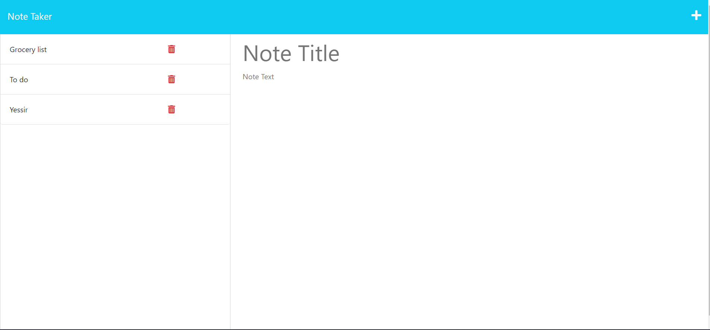
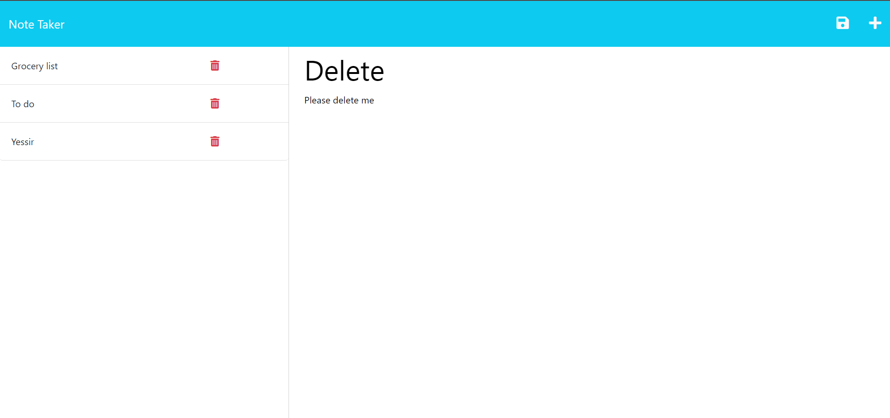
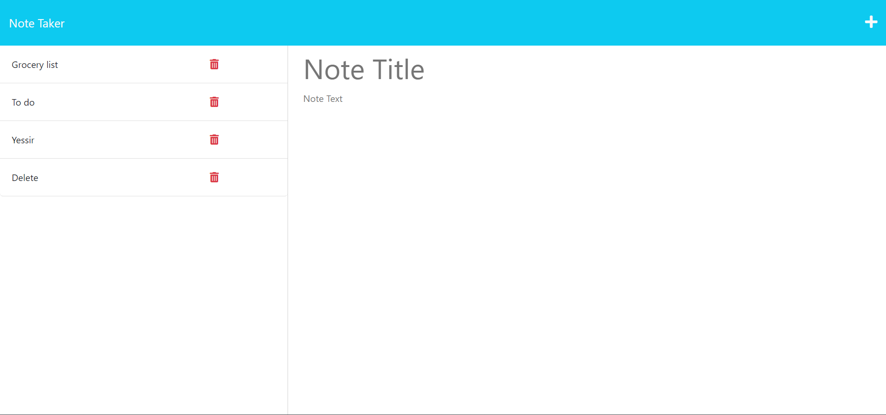
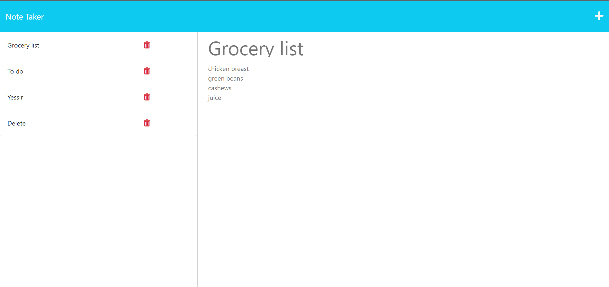

# Note Taker

## Description

This is a site that allows you to write and title notes that are stored on the website. When you click on the note it will appear on the right hand side displaying the full description. You can also delete notes by utilizing the trash can icon on the right side of the list of notes

## Usage

- When you go to the site you are shown a shown the homepage

- Clicking the 'get started' button takes you to the /notes route

- You can type in a note and give it a title. Then save it with the save icon

- You can also view notes to see the desciption by clicking on them

## Links

Github Repo - https://github.com/QDatcher/Note-Taker
Live Site - https://qd-note-taker.herokuapp.com/